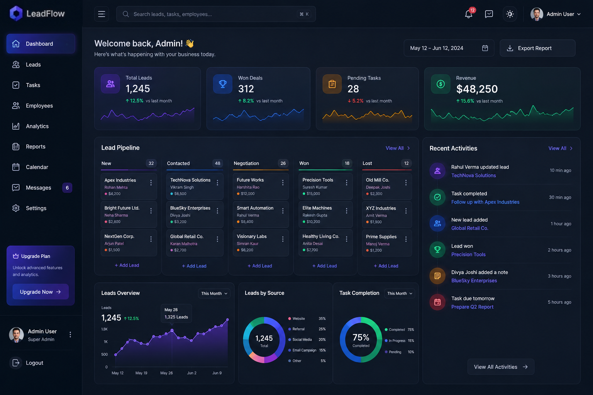

# LeadFlow CRM

LeadFlow CRM is a modern customer relationship management website built for teams that need to manage leads, track tasks, monitor performance, and collaborate inside shared workspaces. The application combines a polished dark UI with CRM workflows such as lead pipelines, task boards, analytics dashboards, authentication, and workspace-based data organization.

The design focuses on a premium SaaS experience: glowing dashboard cards, interactive charts, kanban-style boards, responsive navigation, and clean landing-page sections that explain the product before users sign in and login.

### Logo

<!-- Add image: LeadFlow.png -->


### Landing Page

<!-- Add image: Landing Page 1.png -->


<!-- Add image: Landing Page 2.png -->


### Login Page

<!-- Add image: Login Page.png -->


### Dashboard

<!-- Add image: Dashboard.png -->


### Leads Page

<!-- Add image: Lead Page.png -->


### Tasks Page

<!-- Add image: Task Page.png -->


## About The Website

LeadFlow is presented as an all-in-one CRM and workflow platform for managing leads, teams, and business operations. The public website introduces the product with a strong landing page, feature cards, dashboard previews, and a footer with product, company, resource, and newsletter sections.

After authentication, users enter a protected workspace where they can view CRM metrics, organize lead records, manage tasks, and work with team data. The dashboard highlights important business numbers such as total leads, won deals, pending tasks, and revenue. It also includes pipeline columns, recent activity, lead source charts, and task completion analytics.

## Main Features

- Landing page with hero section, product positioning, feature highlights, dashboard preview, and footer.
- Authentication flow with protected workspace routes.
- Workspace-based CRM structure for organizing users, leads, and tasks.
- Dashboard with KPI cards, lead pipeline, recent activity, charts, and performance summaries.
- Leads page for viewing, filtering, sorting, creating, exporting, and managing lead records.
- Task page with board and table controls, priority sorting, task status columns, and task metrics.
- Employee/team area for workspace members.
- Role-based workspace membership model with admin and member roles.
- Responsive dark interface with gradients, glass panels, icons, and animated UI elements.

## Tech Stack

### Frontend

- React
- Vite
- React Router
- Tailwind CSS
- Framer Motion
- Recharts and Chart.js
- Axios
- Lucide React and Font Awesome icons
- React Query

### Backend

- Node.js
- Express
- Prisma ORM
- PostgreSQL
- JWT authentication
- Bcrypt password hashing
- Cookie parser
- CORS configuration

## Project Structure

```text
.
+-- backend
|   +-- config
|   +-- controllers
|   +-- middleware
|   +-- prisma
|   +-- routes
|   +-- index.js
+-- client
|   +-- public
|   +-- src
|       +-- components
|       +-- context
|       +-- lib
|       +-- pages
+-- README.md
```

## Getting Started

Install dependencies for both apps:

```bash
cd backend
npm install

cd ../client
npm install
```

Create a backend `.env` file with your database and client settings:

```env
DATABASE_URL="your_postgresql_connection_string"
JWT_SECRET="your_jwt_secret"
CLIENT_URL="http://localhost:5173"
PORT=5000
```

Run Prisma setup from the backend folder:

```bash
npx prisma generate
npx prisma migrate dev
```

Start the backend:

```bash
cd backend
npm start
```

Start the frontend:

```bash
cd client
npm run dev
```

The frontend runs on `http://localhost:5173` by default, and the API runs on `http://localhost:5000`.

## Core Pages

- `/` - public landing page.
- `/auth` - sign in and account access page.
- `/workspace` - protected workspace entry.
- `/workspace/:id/dashboard` - CRM dashboard and analytics overview.
- `/workspace/:id/leads` - lead management page.
- `/workspace/:workspaceId/leads/:leadId` - individual lead details.
- `/workspace/:id/tasks` - task workflow board.
- `/workspace/:id/employees` - team and employee management.

## Data Model

The backend uses Prisma with PostgreSQL. The main models are:

- `User` - account details, owned workspaces, memberships, assigned leads, and tasks.
- `Workspace` - shared CRM space with a unique slug and join code.
- `Membership` - connects users to workspaces with `ADMIN` or `MEMBER` roles.
- `Lead` - company, contact, status, notes, assignees, and related tasks.
- `Task` - title, description, priority, status, due date, assignee, lead, and workspace.

## Future Scope

- Add real-time notifications and activity updates.
- Expand reporting with downloadable analytics.
- Add more role permissions for larger teams.
- Improve lead detail views with notes, files, and timeline history.
- Add production deployment documentation.
#
